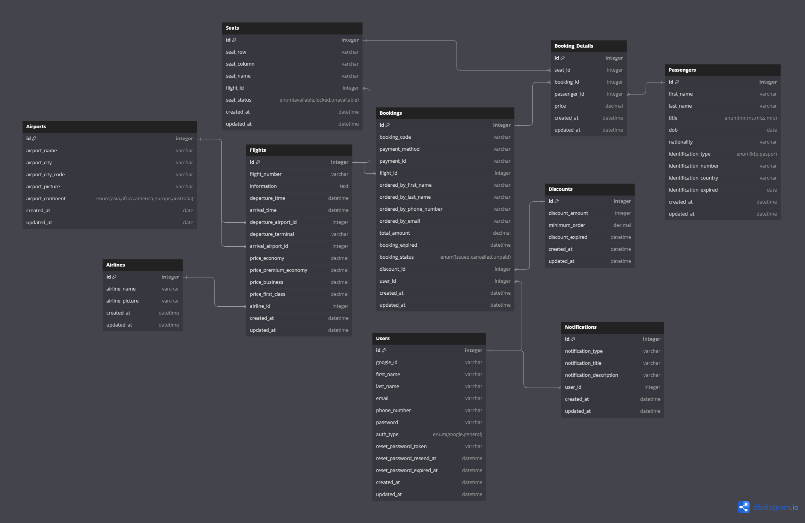

# Airseat

Airseat is an android and web-based application that has features to be able to purchase airplane tickets easily and quickly.

## Documentation

| Documentation | URL                                                                 |
| :------------ | :------------------------------------------------------------------ |
| Swagger       | [Link](https://plucky-agent-424606-s3.et.r.appspot.com/api-docs/#/) |
| Postman       | [Link](https://documenter.getpostman.com/view/22728093/2sA3Qs9Bqn)  |

## Team (Backend)

#### Job Detail

| Name                         | Job Description                                            |
| :--------------------------- | :--------------------------------------------------------- |
| Akbar Rahmat Mulyatama       | Auth System, Booking System API (Booking & Booking Detail) |
| Achmad Sarifitra Noer Rahman | Seat, Flight, Airport API                                  |
| Qonita Afifah                | Airline, Discount API                                      |
| Asyifa Maharani Gustina      | Notification, Passenger API                                |

## DB Structure

     

