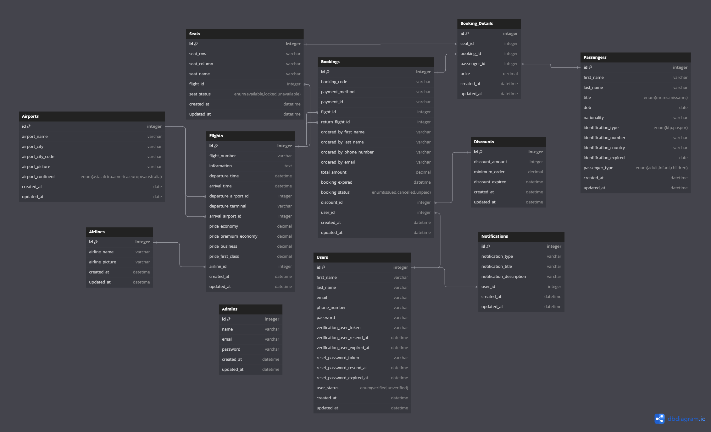

# Airseat

Airseat is an android and web-based application that has features to be able to purchase airplane tickets easily and quickly.

## Documentation

| Documentation | URL                                                                 |
| :------------ | :------------------------------------------------------------------ |
| Swagger       | [Link](https://plucky-agent-424606-s3.et.r.appspot.com/api-docs/#/) |
| Postman       | [Link](https://documenter.getpostman.com/view/22728093/2sA3Qs9Bqn)  |

## Team (Backend)

#### Job Detail

| Name                         | Job Description                                            |
| :--------------------------- | :--------------------------------------------------------- |
| Akbar Rahmat Mulyatama       | Auth System, Booking System API (Booking & Booking Detail) |
| Achmad Sarifitra Noer Rahman | Seat, Flight, Airport API                                  |
| Qonita Afifah                | Airline, Discount API                                      |
| Asyifa Maharani Gustina      | Notification, Passenger API                                |

## DB Structure

     

## Environment Variable

`.env.example` should be copied or renamed to `.env`

| Variable             | Description                                  |
| :------------------- | :------------------------------------------- |
| PORT                 | Node.js PORT Server (Recommend using '3000') |
| DB_NAME              | PostgreSql database name                     |
| DB_USERNAME          | PostgreSql database username                 |
| DB_PASSWORD          | PostgreSql database password                 |
| DB_HOST              | PostgreSql database host                     |
| DB_PORT              | PostgreSql database port (Default : 5432)    |
| SESSION_SECRET       | Session secret for server                    |
| JWT_SECRET           | Credential secret for jwt                    |
| JWT_EXPIRES          | Expired time for jwt                         |
| IMAGEKIT_PUBLIC_KEY  | Imagekit Public Key                          |
| IMAGEKIT_PRIVATE_KEY | Imagekit Private Key                         |
| IMAGEKIT_URL         | Imagekit URL Key                             |
| APP_EMAIL_ADDRESS    | Email address for sending email              |
| APP_EMAIL_PASSWORD   | Email password for sending email             |

## Dashboard Admin

[Dashboard Admin URL](https://plucky-agent-424606-s3.et.r.appspot.com/admin)

We have a comprehensive admin dashboard designed for efficient data management. This dashboard provides tools and features that facilitate effective data handling, monitoring, and analysis.

#### Preview

